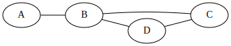
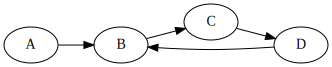
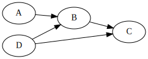
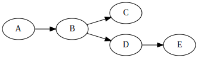
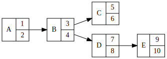
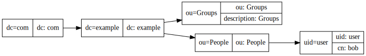

The LDAP Guide Part 1: Foundations
==================================

To understand LDAP we must understand a number of concepts of datastructures: Specifically graphs.

Undirected
----------

In computer science, a set of nodes, connected by some set of edges is called a graph. Here we can see a basic example of a graph.

Viewing this graph, we can see that it has a number of properties. It has 4 nodes, and 4 edges. As this is undirected we can assume the link A to B is as valid as B to A.

We also have a cycle: That is a loop between nodes. We can see this in B, C, D. If any edge between the set of B, D or B, C, or C, D were removed, this graph would no longer have cycles.

Directed
--------

A directed graph is where each edge not only defines a link between two nodes, but also the direction of the link. For example, we can see that A to B is a valid edge, but B to A is not. We would say that the node where the link is from is the outgoing node of the edge. Where the node recieves an egde, IE the arrow, is an incoming edge.

In this graph, for a cycle to occur, we must have a set of nodes where not only the edges exist, but the direction allows a loop. Here, the cycle is B, C, D. Were the link between C and D reversed, we no longer have a cycle in our directed graph.

Trees
-----

A tree is a special case of the directed graph. The properties of a tree are that:

* Each node has 1 and only 1 incoming edge.
* The graph may have no cycles.

An example of a. You can check and it maintains all the properties above. Note there is no limit to outbound edges, the only rule is maximum of one incoming.

More on nodes
-------------

So far our nodes have been a bit bland. We can do more with them though. Instead of just storing a single datum in them, we can instead store the datum as a key to lookup the node, and then have a more complex data in the value of the node. For example, we can expand our tree to look like this:

What does LDAP look like
------------------------

LDAP is a tree of objects. Each object has a name, or an RDN. Relative Distinguished Name. The object itself has many key: value pairs. If we visualise this, it looks like this.

We have the rdn, displayed by type=value, and then a set of attributes. We can traverse the tree by following the keys down the tree.

We can make a Fully Qualified Distinguished Name, or just Distinguished Name, by joining the RDN components. For example, uid=user,ou=People,dc=example,dc=com.

This should explain why LDAP is called a "tree", why objects are named the way they are, and help you to visualise the layout of data in your own tree.

.. author:: default
.. categories:: none
.. tags:: none
.. comments::
