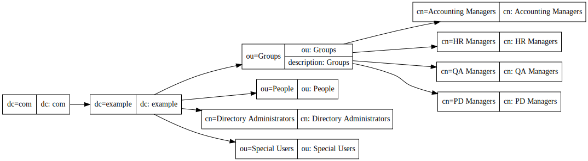
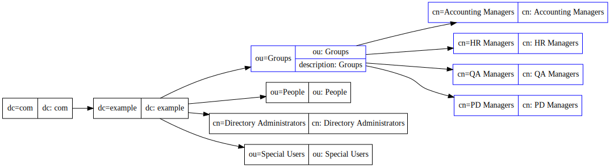
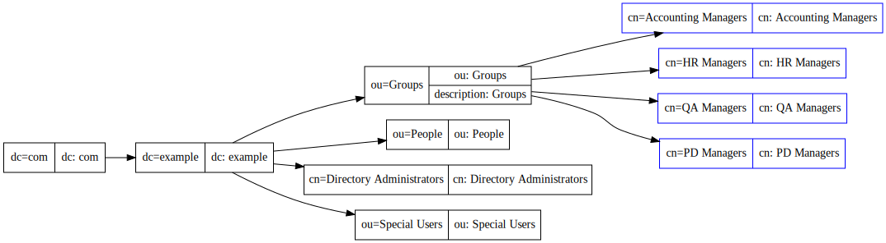
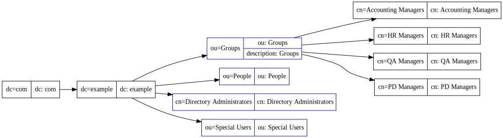
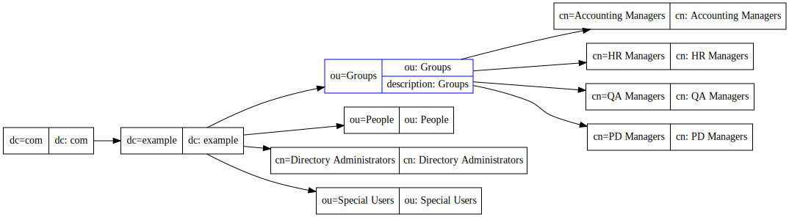

The LDAP Guide Part 2: Searching
================================

In the first part, we discussed how and LDAP tree is laid out, and why it's called a "tree".

In this part, we will discuss the most important and fundamental component of ldap: Searching.

A note is that *all* examples and commands in this document *work*. I have established an internet facing ldap server with which you can query to test out searches. This will work on any RPM based system with openldap-clients installed, or OSX.

To test connectivity you should see the following:

::

    I0> ldapsearch -H ldap://exampleldap.blackhats.net.au -b '' -s base -x -LLL vendorVersion
    dn:
    vendorVersion: 389-Directory/1.3.4.0 B2016.175.1716

If you see any other errors, you have some issue with your network or environment.

Introduction
------------

Remember that we have a tree of objects, organised by their RDN, the Relative Distinguished Name.

An LDAP object looks like this:

::
    dn: ou=Groups,dc=example,dc=com
    objectClass: top
    objectClass: organizationalunit
    ou: Groups

We see the dn, which is the FQDN, built from the RDN components. We have a number of objectClasses that defined the structure and attributes of the object. Finally, we have the attribute "ou", which in this case happens to be our RDN.

A more "complete" object is this example:

::

    dn: cn=Accounting Managers,ou=Groups,dc=example,dc=com
    objectClass: top
    objectClass: groupOfUniqueNames
    cn: Accounting Managers
    ou: groups
    description: People who can manage accounting entries
    uniqueMember: cn=Directory Manager

Again we can see the DN, the objectclasses, and the cn, which is our RDN. We also have a number of other attributes, such as ou, description, uniqueMember. This are *not* part of the RDN, but they are still parts of the object.

Basic searching
---------------

Because LDAP is a tree, we must define a basedn: The "root" or "anchor" point in the tree we want to search beneath. To show what basedns are avaliable, we can query the special '' or blank rootDSE (Directory Server Entry).

::

    ldapsearch -H ldap://exampleldap.blackhats.net.au -b '' -s base -x namingContexts
    ...
    namingContexts: dc=example,dc=com

We can now use this in our search command: Note the -b argument. This is the search basedn.

::

    ldapsearch -H ldap://exampleldap.blackhats.net.au -x -b 'dc=example,dc=com'

You should see a lot of data on your screen from that last command! We just showed every object in the tree. Here is the layout of the data in the exampleldap server to help you understand that output.

Using a different basedn
------------------------

We are not just limited to using the basedn "dc=example,dc=com". This returns a lot of data, so sometimes we might want to focus our search.

By default LDAP is performing what is called a *subtree* search. A subtree search means "include all entries including the basedn in my search".

Lets say we wanted to see just the entries highlighted in blue.

The solution is to *change* the basedn of our search.

::

    ldapsearch -H ldap://exampleldap.blackhats.net.au -x -b 'ou=Groups,dc=example,dc=com'

Now you should see that we only see the results highlighted in blue.

You can try this for other parts of the directory too.

Limiting the scope of the search
--------------------------------

As previously mentioned, we are by default performing a subtree search for ldap. But perhaps we only wanted to focus our search further.

This is controlled by the '-s' parameter to the ldapsearch command.

In this case, we want only the nodes again, in blue. This time we want only the child entries of ou=Groups, but *not* ou=Groups itself.

Now we need to limit not the basedn of the search, but the *scope*. The ldap search scope says which entries we should use. We have already discussed subtree. In this case we want to use the scope called *onelevel*. This means "search entries that are direct children of the basedn only".

::

    ldapsearch -H ldap://exampleldap.blackhats.net.au -x -s onelevel -b 'ou=Groups,dc=example,dc=com'

From the result, you can see, we only see the entries again in blue.

A key point of onelevel is the direct children only are searched. So were we to move the basedn back up to dc=example,dc=com, and perform a onelevel search, we will only see the following.

:: 

    ldapsearch -H ldap://exampleldap.blackhats.net.au -x -s onelevel -b 'dc=example,dc=com'

In addition to subtree and onelevel we have one more search scope. The final scope is named 'base'. This search scope returns *only* the basedn of the search.

So if we were to want to retrieve a single entry by FQDN, this is how we would achieve that.

::

    ldapsearch -H ldap://exampleldap.blackhats.net.au -x -s base -b 'ou=Groups,dc=example,dc=com'

Filtering a set of objects
--------------------------

The most important part of a search is likely the filter. This defines a query where the objects returned must match the filter conditions.

A filter applies to every attribute of every object within the search scope. IE It does not just apply to the RDN of the object.

Filters take the form:

::

    (attribute=value)

Filters can be nested also with special conditions. The condition applies to all filters that follow within the same level of brackets.

::

    (condition (attribute=value)(attribute=value))

By default, ldapsearch provides the filter

::

    (objectClass=*)

* is a special value, representing "any possible value". Because all objects must have an objectClass, this filter is the equivalent to saying "all objects".

You can see this doesn't change the output when we run these two commands:

::

    ldapsearch -H ldap://exampleldap.blackhats.net.au -x -s sub -b 'ou=Groups,dc=example,dc=com' '(objectClass=*)'
    ldapsearch -H ldap://exampleldap.blackhats.net.au -x -s sub -b 'ou=Groups,dc=example,dc=com'

If we were to want to retrieve *only* the HR Managers group, but we didn't know it's RDN / DN, we could use this in our filter.

::

    ldapsearch -H ldap://exampleldap.blackhats.net.au -x -s sub -b 'ou=Groups,dc=example,dc=com' '(cn=HR Managers)'

Say that you did not know that the HR Managers group was in ou=Groups. The following would also be valid:

::

    ldapsearch -H ldap://exampleldap.blackhats.net.au -x -s sub -b 'dc=example,dc=com' '(cn=HR Managers)'

Thus, you often see most queries using the base namingContext of the directory, but applying filters to limit the objects returned.

More complex filters than this exist, and will be part 3 of this guide.

Attributes: Limiting what we get back
-------------------------------------

When we are searching, we often do not want the entire object returned to us. We only need to see one important piece of data. For our HR Managers group, we want to know who the members are. Recall the object is:

::

    dn: cn=HR Managers,ou=Groups,dc=example,dc=com
    objectClass: top
    objectClass: groupOfUniqueNames
    cn: HR Managers
    ou: groups
    description: People who can manage HR entries
    uniqueMember: cn=Directory Manager

We only want to know who is in the uniqueMember attribute: We do not care for the other values.

The final part of an ldapsearch is control of what attributes are returned. Once the scope and filters have been applied, the set of objects returned will only display the attributes in the list.

To do this, you put a space seperated list at the end of the ldap search command:

::

    ldapsearch -H ldap://exampleldap.blackhats.net.au -x -s sub -b 'dc=example,dc=com' '(cn=HR Managers)' uniqueMember

You can return multiple attributes if you wish:

::

    ldapsearch -H ldap://exampleldap.blackhats.net.au -x -s sub -b 'dc=example,dc=com' '(cn=HR Managers)' uniqueMember cn

Conclusion
----------

Ldapsearches tend to be very foreign to application developers and engineers when they first encounter them. Unlike SQL they are not based on tables and selects, and often the data is more complex is disparate. However with these controls, being basedn, scope, filter and attributes, you can completely direct your search to return the exact data that you require for your application or query.

Notes:
------

The ldap server for this example is setup as:

::

    sudo yum install -y 389-ds-base

example-setup.inf

::

    [General]
    FullMachineName = localhost.localdomain
    ServerRoot = /lib/dirsrv
    SuiteSpotGroup = dirsrv
    SuiteSpotUserID = dirsrv
    StrictHostCheck = false
    [slapd]
    AddOrgEntries = Yes
    AddSampleEntries = No
    HashedRootDNPwd =
    InstallLdifFile = suggest
    RootDN = cn=Directory Manager
    RootDNPwd =
    ServerIdentifier = example
    ServerPort = 389
    Suffix = dc=example,dc=com
    bak_dir = /var/lib/dirsrv/slapd-example/bak
    bindir = /bin
    cert_dir = /etc/dirsrv/slapd-example
    config_dir = /etc/dirsrv/slapd-example
    datadir = /share
    db_dir = /var/lib/dirsrv/slapd-example/db
    ds_bename = userRoot
    inst_dir = /lib/dirsrv/slapd-example
    ldif_dir = /var/lib/dirsrv/slapd-example/ldif
    localstatedir = /var
    lock_dir = /var/lock/dirsrv/slapd-example
    log_dir = /var/log/dirsrv/slapd-example
    naming_value = example
    run_dir = /var/run/dirsrv
    sbindir = /sbin
    schema_dir = /etc/dirsrv/slapd-example/schema
    sysconfdir = /etc
    tmp_dir = /tmp

::

    setup-ds.pl --silent --file example-setup.inf
    firewall-cmd --zone=internal --add-service=ldap
    systemctl enable dirsrv@example
    systemctl stop dirsrv@example
    db2ldif -Z example -n userRoot
    crontab -e # Put in refresh.sh to run every 4 hours.

refresh.sh

::

    #!/bin/bash
    systemctl stop dirsrv@example
    ldif2db -Z example -n userRoot -i /var/lib/dirsrv/slapd-example/ldif/example-userRoot-2016_07_05_103810.ldif
    systemctl start dirsrv@example

.. author:: default
.. categories:: none
.. tags:: none
.. comments::
