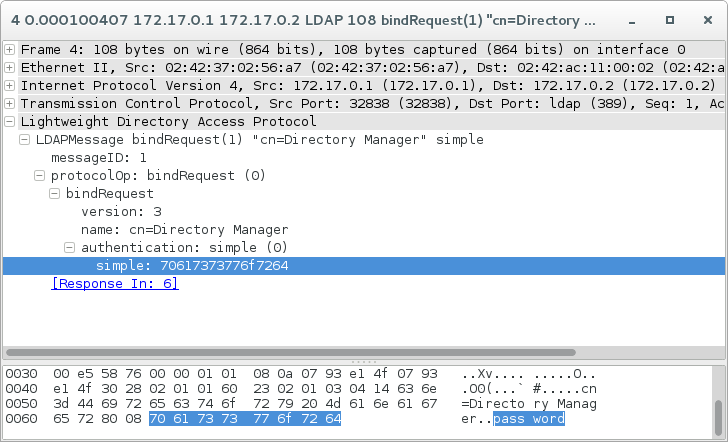
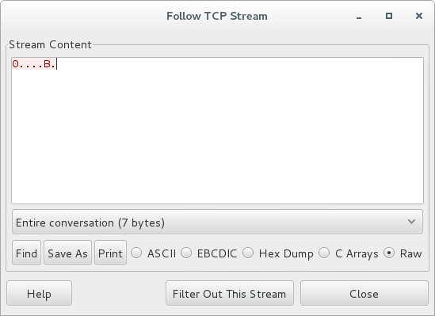

The minssf trap
===============

In directory server, we often use the concept of a "minssf", or the "minimum security strength factor". This is derived from cyrus sasl. However, there are some issues that will catch you out!

.. more::

First, SSF numbers are a bit of a mystery. You need to dig into sasl.h to find them:

::

    /*****************************
     * Security preference types *
     *****************************/

    /* security layer strength factor -- an unsigned integer usable by the caller
     *  to specify approximate security layer strength desired.  Roughly
     *  correlated to effective key length for encryption.
     * 0   = no protection
     * 1   = integrity protection only
     * 40  = 40-bit DES or 40-bit RC2/RC4
     * 56  = DES
     * 112 = triple-DES
     * 128 = 128-bit RC2/RC4/BLOWFISH
     * 256 = baseline AES
     */

Remember, GSSAPI with security is only ssf 56 as I'm aware, and so TLS is going to be at least 128 or higher.

In Directory Server you can set a minimum required SSF for connections and binds, which is great!

::

    cn: config
    ...
    nsslapd-minssf: 128

That's cool, now if someone tries to bind, but they don't have a secure connection, they won't risk cleartexting their password. Awesome!

Also wrong.

::

    # ldapsearch -H ldap://172.17.0.2 -x -D 'cn=Directory Manager' -W
    ldap_bind: Server is unwilling to perform (53)
    additional info: Minimum SSF not met.

If we wireshark this operation, we see the following.

Right there, we can see the password in clear text, despite having a minssf set!

Why is this? Well, the ldap protocol is made up of messages, and it happens that the first message sent as part of a connection is a bindRequest. Inside the bind request with simple bind, we have to put the password in.

It's only after the first message has been sent with the invalid SSF do we see the message, but it's already too late! We cleartexted the password on the wire already!

Thankfully, we have SASL as an option. We are going to add SASL PLAIN support to Directory Server to solve this issue.

When you do a SASL bind, the request is done in multiple steps: As well, part of the SASL implemenation is that it *will not attempt* a PLAIN or ANONYMOUS bind if the SSF is 0.

As a result, when we do the following with no TLS or StartTLS.

::

    # ldapsearch -H ldap://172.17.0.2 -Y PLAIN -U 'cn=Directory Manager'
    ldap_sasl_interactive_bind_s: Unknown authentication method (-6)
    additional info: SASL(-4): no mechanism available: No worthy mechs found

We are not even prompted for the password: SASL knows this is insecure, and won't allow it to proceed. We can see the result in wireshark.

No cleartext password.

Moral of the story: When possible, use SASL for all authentication attempts to Directory Server.

.. author:: default
.. categories:: none
.. tags:: none
.. comments::
